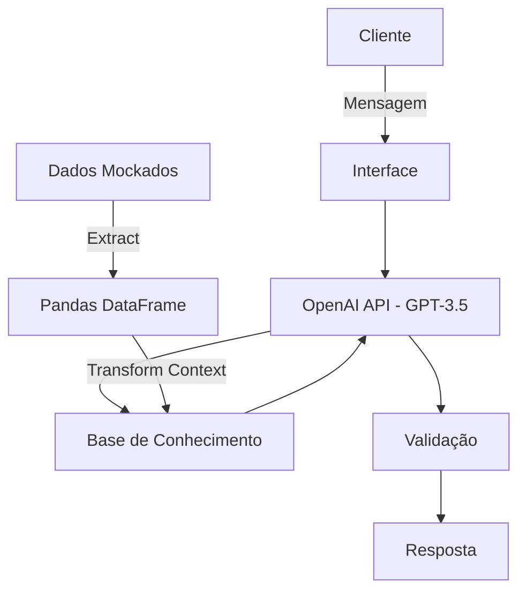

# 🤖 Axis: Agente Financeiro Inteligente com IA Generativa

> Agente de IA Generativa que atua como educador financeira, analisando extratos bancários para gerar insights práticos de economia e tirar dúvidas sem violação de dados sensíveis.

## 💡 O Que é Axis?
O Axis é uma assistente virtual focada em tirar dúvidas e aconselhar sobre organização financeira a partir dos dados financeiros conhecidos e as informações prestadas pelo usuário.

**O que o Axis faz:**
* ✅ Analisa dados tabulares e identifica onde o cliente gasta mais.
* ✅ Gera resumos acolhedores usando linguagem empática e emojis.
* ✅ Fornece dicas práticas e educacionais de economia.

**O que o Axis NÃO faz (Foco em Segurança):**
* ❌ Não recomenda compra de ativos (ações, criptomoedas, etc).
* ❌ Não exige conexão com bancos reais ou upload de planilhas sensíveis.
* ❌ Não alucina taxas de juros ou produtos financeiros inexistentes.
  
## 🏗️ Arquitetura (Pipeline ETL)

